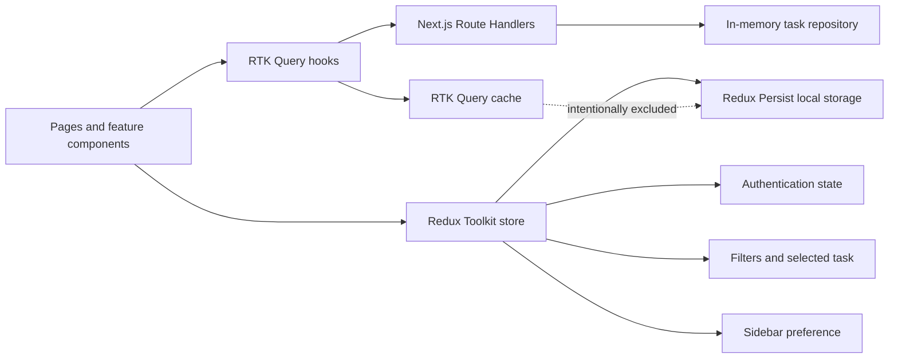

# Taskflow Task Management Dashboard

Taskflow is a responsive task management dashboard created for the Frontend Developer Take-Home Assignment. It demonstrates modular frontend architecture, mock authentication, persisted Redux state, RTK Query API integration, complete task CRUD, responsive layouts, reusable UI, and purposeful animation.

## Assignment Coverage

| Requirement        | Implementation                                                          |
| ------------------ | ----------------------------------------------------------------------- |
| Authentication     | Mock login, protected dashboard routes, persisted session, and logout   |
| Dashboard          | Live Total, Completed, Pending, and High Priority summary cards         |
| Task management    | List, details, create, edit, and delete workflows                       |
| Search and filters | Title search, status filter, priority filter, and due-date sorting      |
| State management   | Redux Toolkit for auth, filters, selected task, and interface state     |
| API integration    | RTK Query queries and mutations connected to Next.js Route Handlers     |
| Persistence        | Authentication, task filters, selected task, and sidebar preference     |
| Theme support      | Persisted light and dark modes using the existing local theme provider  |
| Animations         | Framer Motion page, sidebar, modal, list, card, and progress animations |
| Responsive UI      | Mobile navigation drawer plus tablet and desktop layouts                |
| Feedback states    | Loading skeletons, API errors, empty states, and confirmation dialogs   |
| Code quality       | Strict TypeScript, ESLint, Prettier, typed hooks, and modular features  |

## Quick Start

### Requirements

- Node.js 20 or newer
- npm 10 or newer

### Installation

```bash
git clone <repository-url>
cd task-management-dashboard
npm install
npm run dev
```

Open [http://localhost:3000](http://localhost:3000).

### Demo Login

Authentication is intentionally mocked and only the following demo account is accepted.

```text
Email: alex@example.com
Password: 123456
```

After login, the session is stored by Redux Persist. Refreshing the page keeps the user authenticated until logout.

## Available Commands

| Command                | Purpose                                  |
| ---------------------- | ---------------------------------------- |
| `npm run dev`          | Start the Next.js development server     |
| `npm run build`        | Create an optimized production build     |
| `npm run start`        | Run the production build                 |
| `npm run lint`         | Run ESLint checks                        |
| `npm run format`       | Format the project with Prettier         |
| `npm run format:check` | Verify formatting without changing files |
| `npx tsc --noEmit`     | Run a standalone TypeScript check        |
| `npx next typegen`     | Regenerate typed Next.js routes          |

## Environment Variables

No environment variables are required. The default API base URL is `/api`, which uses the included Next.js Route Handlers.

To use another compatible backend, create `.env.local`:

```bash
NEXT_PUBLIC_API_BASE_URL=https://example.com/api
```

The external service must support the same `/tasks` and `/tasks/:id` contract documented below.

## Application Routes

| Route             | Access    | Description                                       |
| ----------------- | --------- | ------------------------------------------------- |
| `/login`          | Public    | Mock login form                                   |
| `/`               | Protected | Dashboard summaries, progress, and upcoming tasks |
| `/tasks`          | Protected | Searchable task list and CRUD actions             |
| `/tasks/[id]`     | Protected | Detailed task overview and metadata               |
| `/api/tasks`      | API       | Fetch and create tasks                            |
| `/api/tasks/[id]` | API       | Fetch, update, and delete one task                |

## Main Features

### Mock Authentication

- Accepts only the documented `alex@example.com` and `123456` demo credentials.
- Creates a mock user and token in the Redux auth slice.
- Protects dashboard routes with a client authentication guard.
- Redirects authenticated users away from the login page.
- Supports logout from both the sidebar and avatar popover.
- Persists the session through browser refreshes.

### Dashboard

- Calculates summaries from live RTK Query task data.
- Displays Total, Completed, Pending, and High Priority tasks.
- Shows overall completion progress.
- Lists the nearest open deadlines.
- Includes loading and retry states.

### Task Management

- Displays responsive task cards with status, priority, due date, and actions.
- Opens a validated form for task creation and editing.
- Requires confirmation before deletion.
- Provides a dedicated blue-accented detail page.
- Synchronizes list and detail caches after mutations.

### Search and Filters

- Searches task titles case-insensitively.
- Filters by task status.
- Filters by priority.
- Sorts due dates in ascending or descending order.
- Resets all filters with one action.
- Persists filter values using Redux Persist.

### Theme and Responsive Behavior

- Supports persisted light and dark modes.
- Uses a collapsible desktop sidebar.
- Uses an animated navigation drawer on mobile.
- Adapts forms, cards, filters, navigation, and detail views across breakpoints.
- Respects the operating system's reduced-motion preference.

## Architecture

The application follows a feature-oriented structure. Route files compose screens, feature folders own domain behavior, and shared components remain independent of task-specific state.

```text
src/
├── app/
│   ├── (auth)/login/             Public login route
│   ├── (dashboard)/              Protected application routes
│   │   └── tasks/[id]/           Task detail route
│   └── api/tasks/                Mock REST Route Handlers
├── components/
│   ├── common/                   Dialog, loading, empty, and error UI
│   ├── layout/                   Navbar, sidebar, theme, transitions
│   └── ui/                       shadcn UI primitives
├── features/
│   ├── auth/                     Auth slice, login form, route guard
│   ├── dashboard/                Summary cards and dashboard metrics
│   ├── tasks/                    Task API, slice, forms, cards, filters
│   └── ui/                       Shared interface state
├── lib/
│   ├── providers/                Redux and theme providers
│   ├── validations/              Login and task validation
│   └── mockTasks.ts              In-memory task repository
├── store/                        Store, root reducer, typed hooks
├── types/                        Auth and task domain types
├── constants/                    Status and priority constants
└── utils/                        Shared class-name utility
```

### Data Flow



### State Ownership

| State                                | Owner                         | Persisted                        |
| ------------------------------------ | ----------------------------- | -------------------------------- |
| Authenticated user and mock token    | `authSlice`                   | Yes                              |
| Search, filters, sort, selected task | `tasksSlice`                  | Yes                              |
| Sidebar and mobile navigation state  | `uiSlice`                     | Desktop preference only          |
| Task server data and request status  | RTK Query                     | No                               |
| Light or dark theme                  | Theme provider                | Yes, separately in local storage |
| Task records                         | Mock Route Handler repository | No, server memory only           |

The RTK Query cache is deliberately excluded from Redux Persist, matching the assignment requirement.

## API Contract

### Task Shape

```ts
type Task = {
  id: string
  title: string
  description: string
  status: "todo" | "in-progress" | "done"
  priority: "low" | "medium" | "high"
  dueDate: string
  createdAt: string
  updatedAt: string
}
```

### Endpoints

| Method   | Endpoint         | Behavior                      |
| -------- | ---------------- | ----------------------------- |
| `GET`    | `/api/tasks`     | Return all tasks              |
| `POST`   | `/api/tasks`     | Validate and create a task    |
| `GET`    | `/api/tasks/:id` | Return one task or `404`      |
| `PATCH`  | `/api/tasks/:id` | Validate and update a task    |
| `DELETE` | `/api/tasks/:id` | Delete a task or return `404` |

RTK Query tag invalidation refreshes affected task lists and detail queries after create, update, or delete operations.

## Technology Stack

- Next.js 16 App Router
- React 19
- TypeScript
- Tailwind CSS 4
- shadcn/ui and Base UI
- Redux Toolkit and React Redux
- RTK Query
- Redux Persist
- Framer Motion
- Lucide React
- ESLint and Prettier

The assignment requested `next-themes`. This project keeps the pre-existing custom theme provider by explicit project decision; it provides the same light mode, dark mode, toggle, and persistence behavior without that package.

## Validation

Before submission, run:

```bash
npx next typegen
npx tsc --noEmit
npm run lint
npm run format:check
npm run build
```

The first four commands validate generated routes, strict TypeScript, ESLint rules, and formatting. The final command confirms the production bundle in the local environment.

## Implementation Milestones

The assignment work was separated into three focused commits:

1. `99aebaf` Implement persisted mock authentication and protected dashboard access
2. `fc56a17` Build complete task CRUD with RTK Query and persisted filters
3. `da58253` Polish dashboard with responsive navigation animations and project documentation

Later commits contain requested visual refinements to the task detail page and avatar popover.

## Assumptions

- Mock authentication is sufficient, using one fixed demo account rather than a real identity provider.
- Client-side filtering is appropriate for the small assignment dataset.
- ISO date strings are displayed in UTC for consistent server and client output.
- The browser meets the modern baseline supported by Next.js 16.
- A compatible external API returns the same task shape as the mock handlers.

## Known Limitations

- Mock tasks are stored in server memory and reset when the server restarts.
- Mock tokens provide no production security and must not be used for real authentication.
- View Profile, notifications, and help actions are intentionally inactive placeholders.
- The custom theme provider replaces the assignment's requested `next-themes` package.
- Unit and end-to-end tests are outside the one-day assignment scope.
